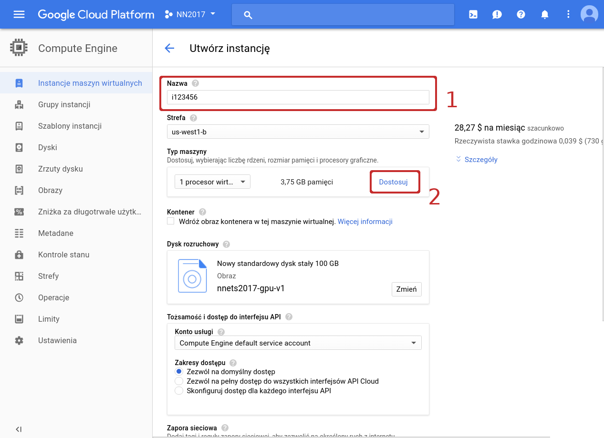
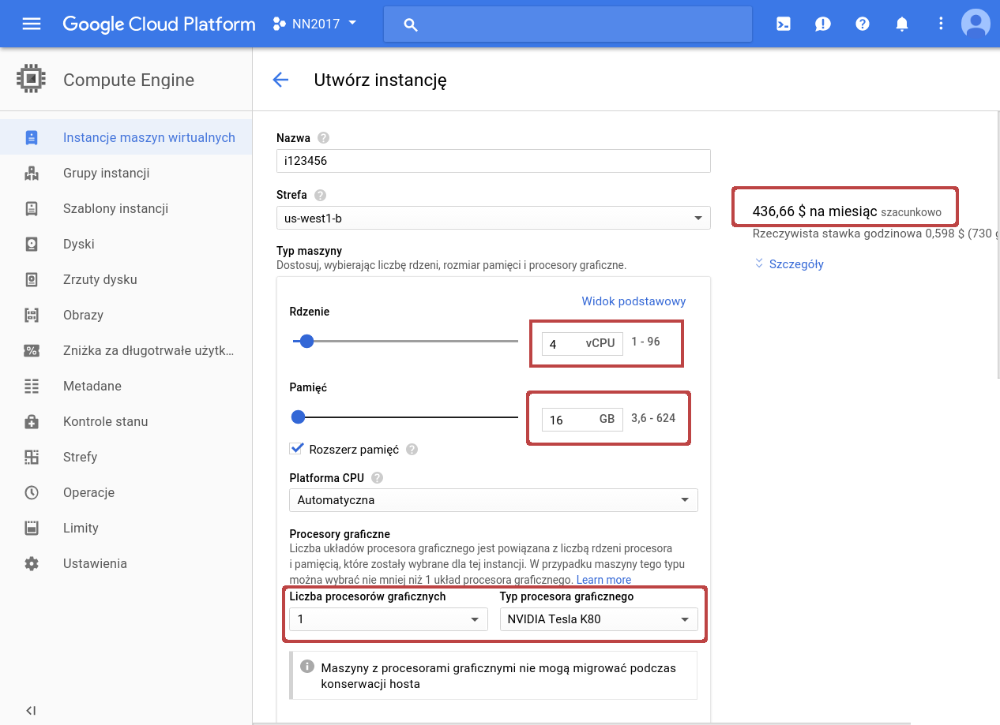
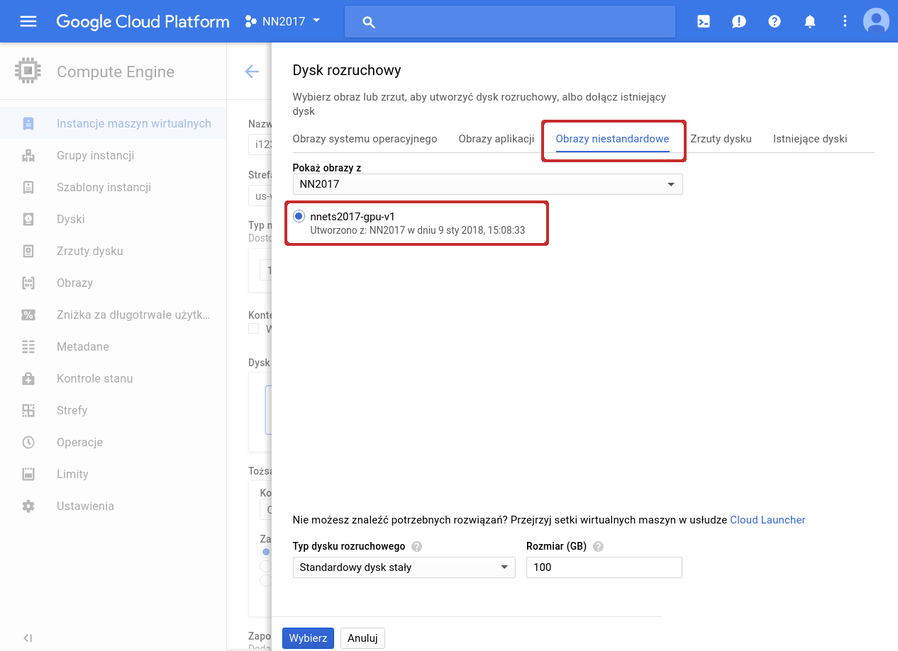
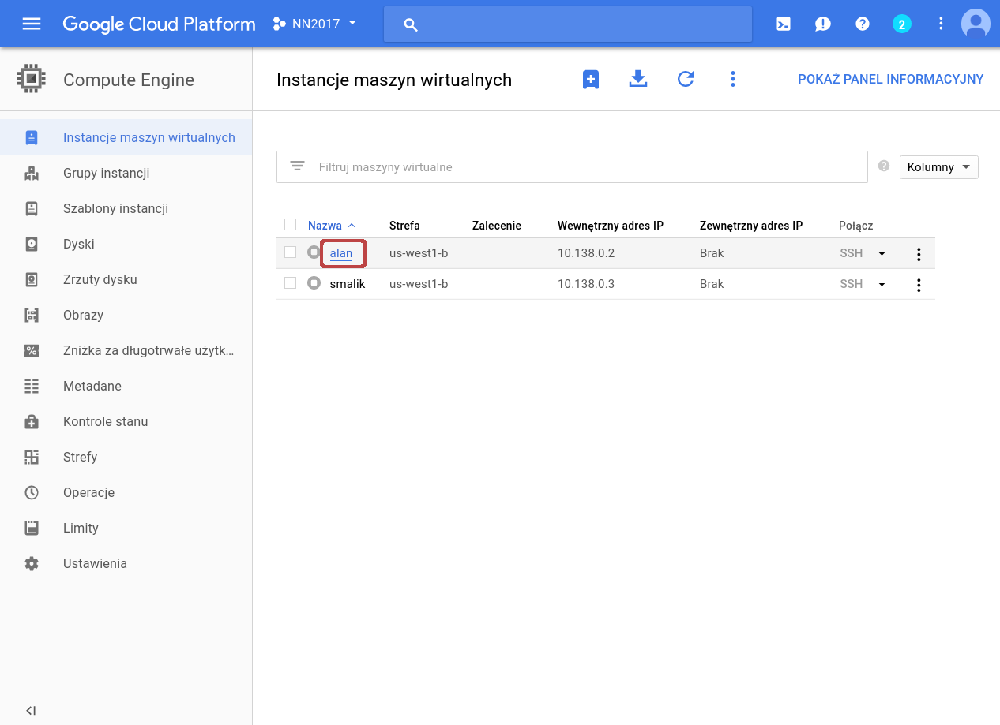
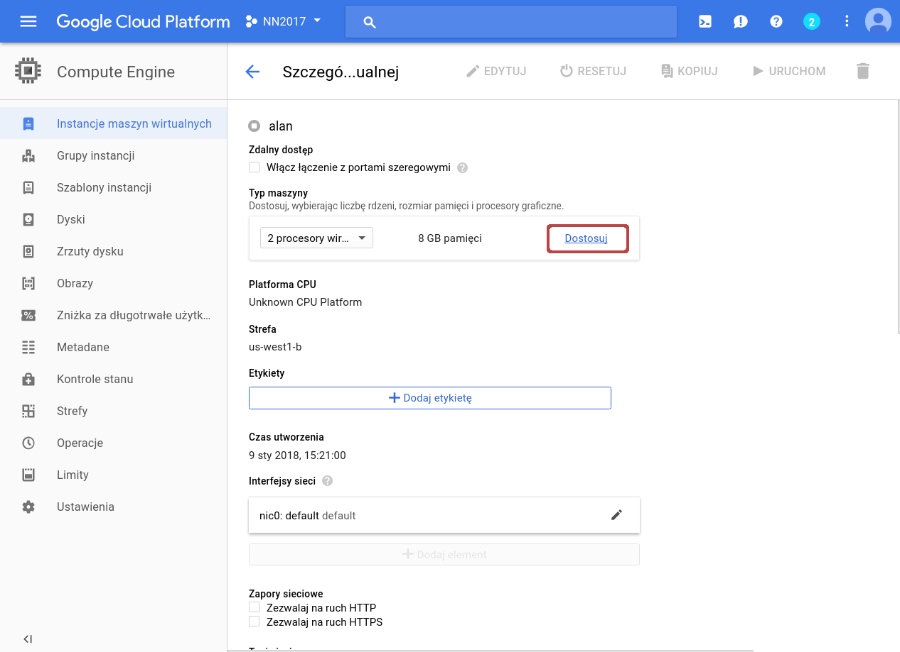

# Using the Google Cloud Platform Compute Engine
Students of the Neural Networks and Deep Learning course at Univerity of Wroclaw
can use the Compute Engine for free (curiosity of Google).

Below we'll shortly outline how to have it up and running in no time.

## 0. Prerequisites

You (or your team) will work on a individual virtual machine(s).
You can create a preconfigured machine with the same software stack
(`/pio/os`) that you are using in the labs!

The instances are billed by hour depending on their hardware configuration.
Please keep in mind, that we have a fixed budget donated by Google.
We will ask you to respect it and:
* turn off the instances when they are not in use,
* if the instances need to be on, but no computations are taking place on the GPUs,
restart the instances with GPUs unmounted (instances without GPUs have much lower running cost),
* do not access or modify virtual machines of your colleagues.

**NOTE: Wasteful or irresponsible behavior will be penalized through subtraction of lab points
(we'll call it ``karny kaktus``).**

## 1. Request the access
Request the account from your lab instructor (via e-mail).
Once you get a confirmation, you can proceed to the next step.

## 2. Log in
Visit [https://cloud.google.com/compute/](https://cloud.google.com/compute/) and log in.

Go to the management console and list the instances.

## 3. Create a new virtual machine

Start by clicking the 'Add' button.

Select a descriptive name, which will make it clear for us who
is the owner or what the project is about. Then set up the hardware.

Select the configuration (sample one is shown below).
Note that the monthly cost is show on the right.
**Select 1 or 2 Tesla K80 GPUs**. If you're unable to select
any GPU, then start by selecting a slightly better vCPU than the stock one.

Select the hard disk image, which features our code stack
(specifically `/pio/os/cuda`, `/pio/os/anaconda`).

## 4. Start the machine and log in

You can start/stop the machine on demand.

A basic `SSH` console can be started in a pop-up
window. You need to allow pop-ups on this particular website!

## 5. Manage the machine

When the machine is off, you can open machine management interface
by clicking on the name of the machine.

You can edit settings and adjust the hardware.

If you need to run the instance without using GPUs for longer perids of time
(e.g., for coding or uploading the data) we ask you to turn off the instance,
edit the hardware and unmount the GPU. This way you will save credits.

To work comfortably:
* add your public ssh keys and connect remotely,
* keep your code in an external repository,
* save snapshots during training and design your code to resume the training in case of failures.
