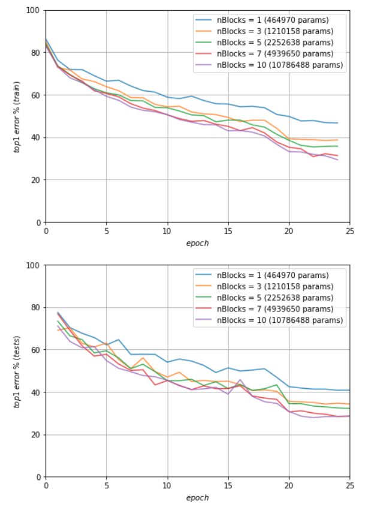

### Reproducibility report for Huang at al. [_"Multi-Scale Dense Networks for Resource Efficient Image Classification"_](https://openreview.net/forum?id=Hk2aImxAb)
###### _Radosław Miernik_, _Arleta Juszczak_

---

This is a reproducibility challenge 2018 report, part of the final project of Neural Network and Deep Learning 2017 class taught at the University of Wrocław.

Arleta Juszczak ([@ajusz](https://github.com/ajusz)), Radosław Miernik ([@radekmie](https://github.com/radekmie)).

---

### Abstract

As a part of the reproducibility challenge, we've attempted to recreate results of this paper. The authors provided a Torch impementation at [`gaohuang/MSDNet`](https://github.com/gaohuang/MSDNet/), but it was not advertised in the anonymous solution. We have based out PyTorch version on it, but learned that it is the reference implementation only after ICLR review results were announced.

As we've successfully run the already mentioned network, our focus was on testing if it's really usable, in a practical way. It means that more than the actual results (which, of course, are very important), we were interested in the easiness of use of this network, namely, susceptibility for the meta parameters changes. In a way, a net which results in few percents less accuracy every time is actually a lot better than a one with easily varying results.

In our opinion, the most interesting part was the multiclassifier one. The idea is to train larger network and evaluate only a part of it (use earlier classifiers as an early-exits). It turned out, that this gives us a lot better classifier for the same computational "price".

### Methodology and resources

Due to limited time and resources, we've managed to test it thoroughly (in many different configurations, not for long runs) on [CIFAR-10](https://www.cs.toronto.edu/~kriz/cifar.html) and [Caltech 101](http://www.vision.caltech.edu/Image_Datasets/Caltech101/) datasets. All experiments involve varying net sizes (various number of blocks) to emphasise the meaning of other hyperparameters and not the net capacity.

### Complete list of experiments

* CIFAR-10
    * `LR=0.10`
    * `LR=0.10` (no bias)
    * `LR=0.10` (no eval)
    * `LR=0.15`
* Caltech 101
    * `LR=0.1, WD=1e-4, 25 epochs` (an initial learning rate of 0.1, divided by a factor 10 after 13 and 19 epochs)
    * `LR=0.05, WD=1e-4, 25 epochs` (an initial learning rate of 0.05, divided by a factor 10 after 13 and 19 epochs)
    * `LR=0.05, WD=1e-4, 25 epochs` (an initial learning rate of 0.05, divided by a factor 10 after 19 epochs)
    * `LR=0.05, WD=1e-5, 25 epochs` (an initial learning rate of 0.05, divided by a factor 10 after 19 epochs)
    * `LR=0.05, WD=1e-4, 50 epochs` (an initial learning rate of 0.05, divided by a factor 10 after 38 epochs)
    * `LR=0.05, WD=1e-4, 100 epochs` (an initial learning rate of 0.05, divided by a factor 10 after 50 and 75 epochs)

### Results averaged over all classifiers (separate for each network)

Testing on the Caltech 101 was pretty straightforward - we've come up with proper preprocessing and net was behaving normally, reaching pretty good results in a relatively short time.

|||
|:---:|:---:|
| *Train and test errors for Caltech 101 trained for 25 epochs.* | *Train and test errors for Caltech 101 trained for 50 epochs.* |

It's worth noting, that due to limited resources, we've trained it only for 25 and 50 epochs. Anyway, it went surprisingly well: error rate to test time ratio per sample is really good.

||
|:---:|
| *Training time per image (in ms) for Caltech 101.* |

On the other hand, testing the CIFAR-10 was... Odd. At first, we've checked only the end results and we were amazed by its results.

||
|:---:|
| *Train errors for CIFAR-10 trained for 25 epochs.* |

Then we've analyzed the validation errors...

||
|:---:|
| *Test errors for CIFAR-10 trained for 25 epochs.* |

It's, well, weird. We've spent some time digging. Yes, these drops happen at the learning rate drops, but using a lower learning rate resulted in no converging at all. We've tried to disable or even remove the batch normalizations (we were told that it might be an issue). In one case, it was inherently bad (started at 90% error rate, went to 100% and stayed there forever), in the other it looked the same, but it was converging even slower.

We are aware of a possible bug in our implementation. Anyway, we wanted to note that, as one testing this network would become discouraged to continue further computations.

### Results for various classifiers

The great thing about MSDNets is that it is possible to provide the ability to output a prediction at any time while maintaining
high accuracies throughout. For example, we trained MSDNet with 5 blocks for 25 epochs on CIFAR-10 and during testing, it had 22% error rate in first and 13% error rate in the fifth classifier. We repeated the same training on MSDNet with 10 blocks and during testing, it had 20% error rate in first and only 11% error rate in the fifth classifier! Finally, after the tenth block, it had 10% error rate. Therefore, it is true that we can train a larger network, getting better results in earlier classifiers than the smaller one and then, during testing, use just a part of this network and get great results.

### Summary

* We've run the actual implementation. The net worked really well, so we focused on implementing it in PyTorch and testing on other datasets (CIFAR-10 and Caltech 101).
* We've checked if training large network (with multiple classifiers) and using just a part of it during testing is possible (we can use earlier classifiers as an early-exits) and what are the results. It's actually working and yielding great results.
